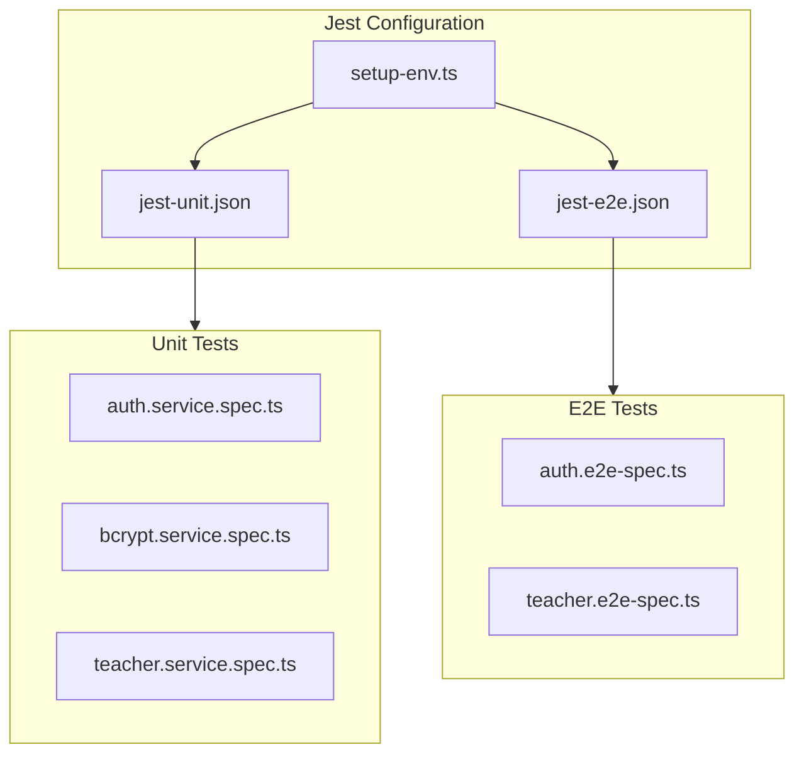

# Auth & Teacher Module Test Implementation

## Overview

Implement unit and E2E tests for the `auth` and `teacher` modules with proper Jest configuration to load environment variables from `.env.testing.local`.

## Architecture




## 1. Jest Configuration

### Create environment setup file

Create [`backend/test/setup-env.ts`](backend/test/setup-env.ts) to load `.env.testing.local` using `dotenv` before tests run.

### Create unit test config

Create [`backend/test/jest-unit.json`](backend/test/jest-unit.json):

- Root directory: `../src`
- Pattern: `*.spec.ts` files
- Setup file: `./setup-env.ts`

### Update E2E test config

Modify [`backend/test/jest-e2e.json`](backend/test/jest-e2e.json):

- Add `setupFiles` to load environment variables
- Configure module path aliases

## 2. Unit Tests

### AuthService tests ([`backend/test/unit/auth/auth.service.spec.ts`](backend/test/unit/auth/auth.service.spec.ts))

Test cases:

- `generateTokens()` - returns valid access and refresh tokens
- `registerAdmin()` - success with valid secret key
- `registerAdmin()` - throws UnauthorizedException with invalid secret key
- `registerAdmin()` - throws BadRequestException if admin exists
- `validateUser()` - returns teacher with valid credentials
- `validateUser()` - throws UnauthorizedException if user not found
- `validateUser()` - throws UnauthorizedException with wrong password

### BcryptService tests ([`backend/test/unit/auth/bcrypt.service.spec.ts`](backend/test/unit/auth/bcrypt.service.spec.ts))

Test cases:

- `generateHash()` - generates a valid hash
- `checkPassword()` - returns true for correct password
- `checkPassword()` - returns false for incorrect password

### TeacherService tests ([`backend/test/unit/teacher/teacher.service.spec.ts`](backend/test/unit/teacher/teacher.service.spec.ts))

Test cases:

- `getTeacherById()` - returns teacher by ID
- `getTeacherByLogin()` - returns teacher by login
- `getTeachers()` - returns all teachers
- `createTeacher()` - creates teacher successfully
- `createTeacher()` - throws BadRequestException if teacher exists

## 3. E2E Tests

### Auth endpoints ([`backend/test/e2e/auth.e2e-spec.ts`](backend/test/e2e/auth.e2e-spec.ts))

| Endpoint | Test Cases ||----------|------------|| `POST /auth/login` | Success with valid credentials, 401 with invalid login, 401 with wrong password || `POST /auth/register-admin` | Success with valid secret key, 401 with invalid secret key, 400 if admin exists || `POST /auth/refresh-token` | Success with valid refresh token, 401 with invalid/missing token |

### Teacher endpoints ([`backend/test/e2e/teacher.e2e-spec.ts`](backend/test/e2e/teacher.e2e-spec.ts))

| Endpoint | Test Cases ||----------|------------|| `GET /teachers` | Success with admin JWT, 401 without token, 401 with non-admin token || `POST /teachers` | Success creating teacher, 400 if teacher exists, validation errors |

## 4. Test Utilities

Create [`backend/test/helpers/test-utils.ts`](backend/test/helpers/test-utils.ts):

- Helper to create test NestJS application
- Helper to generate test JWT tokens for authenticated requests
- Helper to clean up test data between tests

## Key Implementation Details

- **Mocking in Unit Tests**: Use Jest mocks for dependencies (PrismaService, JwtService, etc.)
- **Real Database in E2E**: Tests will use the actual test database from `.env.testing.local`
- **Test Isolation**: Each E2E test suite should clean up created data in `afterAll`
- **Throttler**: Disable or mock ThrottlerGuard in E2E tests to avoid rate limiting

## File Structure

```javascript
backend/test/
  setup-env.ts           # Environment loader
  jest-unit.json         # Unit test config
  jest-e2e.json          # E2E test config (updated)
  helpers/
    test-utils.ts        # Shared test utilities
  unit/
    auth/
      auth.service.spec.ts
      bcrypt.service.spec.ts
    teacher/
      teacher.service.spec.ts
  e2e/
    auth.e2e-spec.ts
    teacher.e2e-spec.ts


```