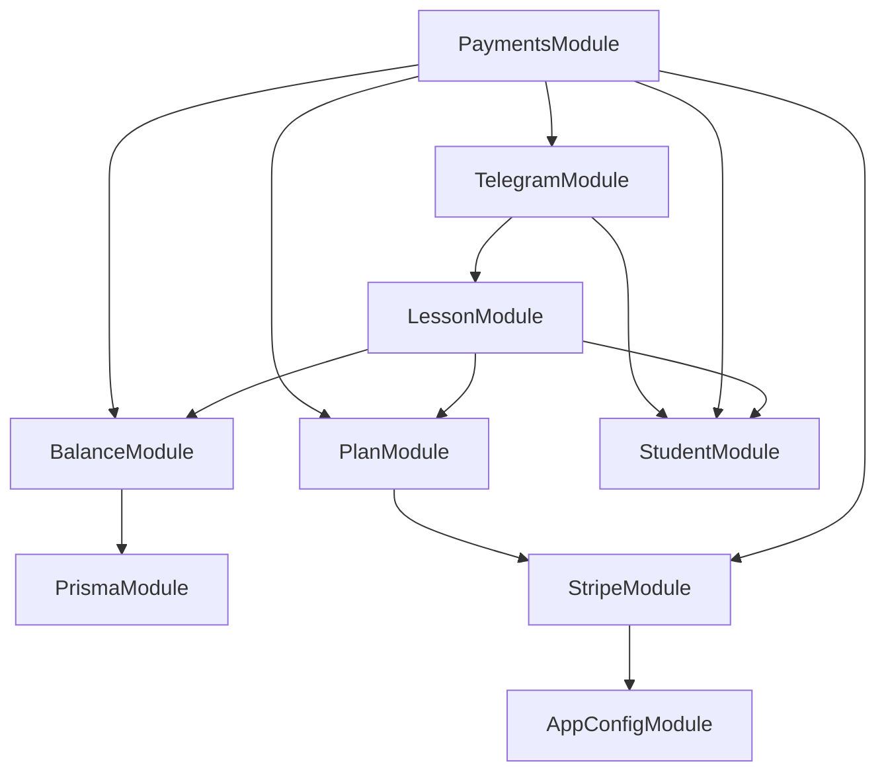
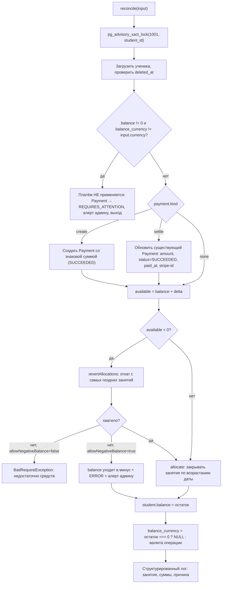
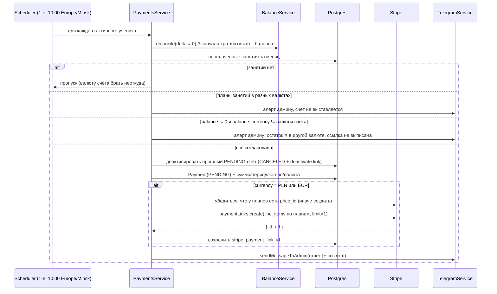

# Модуль оплат: Stripe + баланс учеников

## Зафиксированные решения

- Валюта: `Plan.plan_currency` и валюта ученика сводятся к **одному** enum `Currency { EUR, PLN, BYN }`; USD/RUB удаляются (в БД таких планов нет). Stripe задействуется только для PLN/EUR.
- Валюта принадлежит **балансу, а не ученику**: `Student.payment_currency` → `balance_currency Currency?`, `NULL` при нулевом балансе. Валюта расчётов выводится из планов назначенных занятий (§1.6).
- Баланс — в **целых единицах** валюты (30 = 30 PLN). Конвертация `×100` только на границе со Stripe.
- Баланс закрывает занятия **с начала месяца периода оплаты** (для платежа без периода — с начала текущего месяца), по возрастанию даты. Долги за прошлые месяцы автоматически не гасятся.
- Отмена оплаченного занятия (`CANCELLED`) → деньги возвращаются на баланс. Пропуск (`MISSED`) → деньги сгорают.
- Перенос наследует оплату: если у оригинала есть активная аллокация, новое занятие создаётся `PENDING_PAID` и аллокация переносится.
- Ссылка — **Payment Link** с `restrictions[completed_sessions][limit] = 1` (не истекает, одноразовый; после оплаты Stripe деактивирует её сам — [docs.stripe.com/payment-links/customize](https://docs.stripe.com/payment-links/customize)).
- Ручное управление балансом — **дельтой** (`+/-` с обязательным комментарием), каждая операция пишется в историю.
- Крон — `@Cron('0 10 1 * *', { timeZone: 'Europe/Minsk' })`. Ученикам с BYN отчёт отправляется, но без ссылки.

### Важное уточнение к правилу «с начала месяца»

Занятие, прошедшее сегодняшней ночью, крон `updateLessonsStatus` переводит `PENDING_UNPAID → COMPLETED_UNPAID` ([lesson.repository.ts](backend/src/modules/lesson/infrastructure/lesson.repository.ts) строки 224–248). Счёт выставляется 1-го, а оплата ожидается до 10-го — значит к моменту оплаты занятия с 1-го по 10-е уже будут `COMPLETED_UNPAID` и по буквальному правилу «только `PENDING_UNPAID`» оплату бы не получили.

Поэтому в выборку берутся **оба** неоплаченных статуса, но только с датой `>= начало месяца периода`:

- `PENDING_UNPAID → PENDING_PAID`
- `COMPLETED_UNPAID → COMPLETED_PAID`

Это сохраняет требование «прошлые долги не трогать» (они отсекаются по дате, а не по статусу).

---

## Что уже сделано в рабочей копии (проверено)

Эти пункты плана закрыты и подтверждены — `npx tsc --noEmit` проходит чисто:

- `Currency` сведён в один enum: `schema.prisma`, миграция `20260806190000_unify_currency_enum`, `src/shared/enums/currency.enum.ts`, DTO плана/ученика, `lesson.repository.ts`, `student.repository.ts`, обновлённые фикстуры в e2e/unit тестах.
- Модели `Payment`, `LessonPayment`, `StripeWebhookEvent`, поля `Plan.stripe_product_id/stripe_price_id`, частичные unique-индексы и бэкфилл — миграция `20260806191500_add_payments`.
- `src/infrastructure/stripe/`: `stripe.constants.ts`, `stripe.module.ts` (клиент через `@Inject(stripeConfig.KEY)`, `maxNetworkRetries: 2`, `timeout: 20_000`, без `@Global()`), `stripe.service.ts` (продукт+цена, payment link с `restrictions.completed_sessions.limit = 1`, деактивация, `constructWebhookEvent`).
- `stripe.config.ts` в namespace-конфиге + подключён в `app-config.module.ts`; `STRIPE_SECRET_KEY`/`STRIPE_WEBHOOK_SECRET` в `env.schema.ts`, `.env.testing`, `.env.example`, `docker-compose.yml`.
- `main.ts` создаёт приложение как `NestFactory.create<NestExpressApplication>(AppModule, { rawBody: true })`.
- `balance.repository.port.ts` + `balance.repository.ts` (advisory-lock, аллокации, откаты, суммы для инварианта), `payment.entity.ts`, `payment-type.enum.ts`, `payment-status.enum.ts`.
- `balance` перенесён в базовый `StudentDto` и `mapStudentToView`.
- Зависимость `stripe@22.4.0` установлена.

> Часть уже написанного кода придётся тронуть повторно из-за §1.6: `balance.repository.port.ts` (`StudentForBalance.payment_currency` → `balance_currency: Currency | null`), `balance.repository.ts`, `student.repository.ts`, DTO ученика и фикстуры тестов. Это учтено в todo `balance-currency` и вынесено первым шагом §13.

## Проблемы в текущем коде, которые правим по ходу

- **Баг в счёте**: [telegram.service.ts](backend/src/modules/telegram/application/telegram.service.ts) строки 174 и 206 суммируют `plan_price` по всем занятиям, включая `is_free` — бесплатные занятия сейчас попадают в сумму к оплате.
- Опечатка в названии месяца `"НОЯБРАТ"` — там же, строка 192.
- `biome.json` в `files.includes` перечисляет `apps/**` и `libs/**`, поэтому `yarn lint` не проверяет `src/` — добавить `src/**/*.ts`, иначе новый код не линтуется.
- `BalanceRepository.updatePayment` не умеет менять `amount` и `lessons_count` — нужно для вебхука (фактическая сумма может отличаться от выставленной). Добавить оба поля.
- `LessonRepository.createSingleLesson` глотает ошибку в `console.log` — при переходе на транзакции заменить на `Logger` и проброс.

Вне скоупа, только сообщаю: [telegram.service.ts](backend/src/modules/telegram/application/telegram.service.ts) строка 125 — `1000 * 60 * 24` с комментарием «24 часа», фактически 24 минуты.

---

## 1. Миграции БД

### 1.1 Единый enum валют — **сделано**

`20260806190000_unify_currency_enum`. Порядок важен (у `payment_currency` есть DEFAULT):

```sql
CREATE TYPE "Currency" AS ENUM ('EUR', 'PLN', 'BYN');
ALTER TABLE "plan" ALTER COLUMN "plan_currency" TYPE "Currency" USING ("plan_currency"::text::"Currency");
ALTER TABLE "student" ALTER COLUMN "payment_currency" DROP DEFAULT;
ALTER TABLE "student" ALTER COLUMN "payment_currency" TYPE "Currency" USING ("payment_currency"::text::"Currency");
ALTER TABLE "student" ALTER COLUMN "payment_currency" SET DEFAULT 'BYN';
DROP TYPE "PlanCurrency";
DROP TYPE "PaymentCurrency";
```

### 1.2 Stripe-поля на плане — **сделано**

`Plan`: `stripe_product_id String? @unique`, `stripe_price_id String? @unique`.

### 1.3 Новые модели — **сделано, с одной правкой**

- `Payment` — история денежных поступлений и корректировок: `student_id`, `type` (`STRIPE_PAYMENT | STRIPE_REFUND | MANUAL_ADJUSTMENT | LEGACY_OPENING_BALANCE`), `status` (`PENDING | SUCCEEDED | CANCELED | FAILED`), `amount Int` (знаковая: списание — отрицательная), `currency Currency`, `period_start/period_end DateTime?`, `lessons_count Int?`, `comment String?`, `created_by_id Int?`, `stripe_payment_link_id/stripe_checkout_session_id/stripe_payment_intent_id String? @unique`, `paid_at`, `created_at`, `updated_at`. Индекс `[student_id, created_at]`.
- `LessonPayment` — аллокация баланса на занятие: `student_id`, `lesson_id`, `payment_id Int?`, `amount Int`, `currency Currency`, `created_at`, `reverted_at DateTime?`. Индексы `[student_id, reverted_at]`, `[lesson_id]`.
- `StripeWebhookEvent` — идемпотентность: `id String @id` (`evt_...`), `type`, `received_at`, `processed_at DateTime?`, `error String?`. Тело события не храним.

**Правка (todo `schema-requires-attention`).** Нужен пятый статус `PaymentStatus.REQUIRES_ATTENTION` — для платежей, которые пришли, но не применены к балансу из-за конфликта валют (§3). Он **не** учитывается в инварианте баланса. Отдельной миграцией (`ALTER TYPE` нельзя откатить внутри транзакции с использованием значения, поэтому только `ADD VALUE`):

```sql
ALTER TYPE "PaymentStatus" ADD VALUE IF NOT EXISTS 'REQUIRES_ATTENTION';
```

**Правка (todo `schema-refund-id`).** Возврат (`STRIPE_REFUND`) относится к тому же `payment_intent`, что и исходный платёж, а `stripe_payment_intent_id` объявлен `@unique` — вторая строка упадёт по уникальности. Поэтому:

- добавить в `Payment` поле `stripe_refund_id String? @unique`;
- у строк типа `STRIPE_REFUND` **не** заполнять `stripe_payment_intent_id`; исходный платёж находим отдельным запросом по `stripe_payment_intent_id = refund.payment_intent`.

Миграция `20260806191500_add_payments` **уже применена** к dev-базе (проверено: 13/13 миграций в `_prisma_migrations` со статусом applied), поэтому редактировать её нельзя — нужна **отдельная** миграция `20260807xxxxxx_add_payment_refund_id`:

```sql
ALTER TABLE "payment" ADD COLUMN "stripe_refund_id" TEXT;
CREATE UNIQUE INDEX "payment_stripe_refund_id_key" ON "payment"("stripe_refund_id");
```

Частичные unique-индексы (Prisma их не умеет, дописаны руками) — **уже в миграции и физически присутствуют в dev-базе** (проверено через `pg_indexes`: `lesson_payment_active_lesson_key btree (lesson_id) WHERE (reverted_at IS NULL)` и `payment_pending_period_key btree (student_id, period_start, period_end) WHERE status='PENDING' AND type='STRIPE_PAYMENT'`):

```sql
CREATE UNIQUE INDEX "lesson_payment_active_lesson_key"
  ON "lesson_payment" ("lesson_id") WHERE "reverted_at" IS NULL;

CREATE UNIQUE INDEX "payment_pending_period_key"
  ON "payment" ("student_id", "period_start", "period_end")
  WHERE "status" = 'PENDING' AND "type" = 'STRIPE_PAYMENT';
```

> `period_start/period_end` у `STRIPE_PAYMENT` всегда заполнены, поэтому «NULL не равен NULL» в Postgres нам не мешает.

### 1.4 Бэкфилл исторических данных — **сделано, фактически no-op**

В той же миграции: `LessonPayment` для всех уже оплаченных занятий (`PENDING_PAID`/`COMPLETED_PAID`, не `is_free`/`is_trial`, `plan_price > 0`) и по одному `Payment` типа `LEGACY_OPENING_BALANCE` на ученика на сумму `student.balance + Σ созданных аллокаций`.

Фактически бэкфилл создал **0 строк** в обеих таблицах, и это корректно: в базе нет ни одного занятия в статусе `PENDING_PAID`/`COMPLETED_PAID`, а `balance` у всех 34 учеников равен 0. Инвариант из §3 на существующих данных выполняется тривиально (`0 === 0 − 0`).

### 1.5 Состояние базы (проверено, влияет на верификацию)

| Факт | Следствие |
|---|---|
| Занятия: 1090 `COMPLETED_UNPAID`, 121 `RESCHEDULED`, 14 `CANCELLED`, 13 `MISSED`, 7 `PENDING_UNPAID` (из них 2 `is_free` + 5 `is_trial`) | Оплаченных занятий нет вообще — движок баланса стартует «с нуля», рисков расхождения на исторических данных нет |
| Диапазон дат занятий: `2026-01-01 … 2026-07-18` | Всё в прошлом. Правило «с начала месяца периода» означает, что **1090 старых долгов первый счёт не тронет** — ровно как в требованиях. Но и автоматически они не погасятся никогда |
| Все 7 текущих `PENDING_UNPAID` — `is_free`/`is_trial` | Ни одно из них в счёт не попадёт; сейчас существующий баг с суммированием `is_free` как раз на них и проявился бы |
| Все 32 активных ученика — `payment_currency = BYN`, **балансы у всех 0** | Миграция переименования в `balance_currency` (§1.6) обнуляет поле у всех без потери информации: значение `BYN` — артефакт `DEFAULT`, а не реальные данные. Для ручной проверки §14 нужен новый тестовый ученик |
| Планы: 1 активный PLN (`INDIVIDUAL`, 40), 5 активных BYN `INDIVIDUAL` (цены 0…35), 2 активных BYN `PAIR` (20…25) | Единственный PLN-план создан до фичи и `stripe_price_id` у него нет → **ленивое дозаведение продукта/цены (§4) — не запасной, а основной путь** |
| Есть планы с `plan_price = 0` (пробные) | Пропуск нулевых цен в аллокации и в Stripe обязателен, кейс живой |

### 1.6 `payment_currency` → `balance_currency`: валюта принадлежит балансу, а не ученику

**Смена модели.** Валюта — не постоянное свойство ученика, а свойство его **текущего остатка**. Валюта расчётов выводится из планов назначенных занятий; поле на ученике нужно ровно затем, что `balance Int` сам по себе не имеет единицы измерения.

Правила:

1. `Student.balance_currency` — валюта денег, лежащих на балансе прямо сейчас.
2. `balance = 0` ⇒ `balance_currency = NULL`. Валюта «отпущена», ученик свободно переходит на любую другую.
3. `balance ≠ 0` ⇒ `balance_currency` заполнена и **менять её нельзя**, пока остаток не обнулится.
4. Ссылка на оплату не генерируется ученику без назначенных неоплаченных занятий — валюту счёта брать неоткуда.
5. Валюта счёта = валюта планов занятий этого счёта. Если планы разной валюты — счёт не выставляется, админу летит алерт.
6. Если `balance ≠ 0` и валюта счёта ≠ `balance_currency` — ссылка **не генерируется**, админу летит алерт с суммой и валютой остатка.

Сценарий из требований работает так: ученик заплатил 40 EUR → `balance_currency = EUR`; деньги ушли на EUR-занятия → `balance = 0`, `balance_currency = NULL`; в следующем месяце занятия по PLN-плану → счёт и ссылка в PLN, конфликта нет.

**Миграция `20260807xxxxxx_rename_payment_currency_to_balance_currency`:**

```sql
ALTER TABLE "student" ALTER COLUMN "payment_currency" DROP DEFAULT;
ALTER TABLE "student" RENAME COLUMN "payment_currency" TO "balance_currency";
ALTER TABLE "student" ALTER COLUMN "balance_currency" DROP NOT NULL;
UPDATE "student" SET "balance_currency" = NULL WHERE "balance" = 0;
ALTER TABLE "student" ADD CONSTRAINT "student_balance_currency_check"
  CHECK (("balance" = 0 AND "balance_currency" IS NULL) OR ("balance" <> 0 AND "balance_currency" IS NOT NULL));
```

В Prisma: `balance_currency Currency?` (без `@default`). `CHECK` Prisma не выражает — дописывается руками в `migration.sql`, как частичные индексы; в `test/setup-migrations.ts` его нужно добавить тем же `$executeRawUnsafe` (§12).

Данные это не портит: **у всех 34 учеников `balance = 0`**, значит `UPDATE` обнулит поле у всех. Текущее `BYN` у всех — артефакт `DEFAULT 'BYN'` из миграции `20260630073647_add_marketing_consist`, которая никогда не бэкфилилась, и никакой информации не несёт. Насколько поле недостоверно — видно по базе:

| student_id | timezone | payment_currency | plan_currency | занятий | период |
|---|---|---|---|---|---|
| 3 (удалён) | PL | BYN | PLN (40) | 16 | 01.2026 – 02.2026 |
| 30 (активен) | PL | BYN | PLN (40) | 45 | 01.2026 – 05.2026 |
| 30 | PL | BYN | BYN (25) | 1 | 16.07.2026 |
| 30 | PL | BYN | BYN (0, пробное) | 1 | 08.01.2026 |

61 занятие с валютой плана ≠ валюте ученика у 2 учеников. После обнуления поля это перестаёт быть конфликтом — остаётся только исторический факт, что у ученика 30 занятия в двух валютах. Все они в прошлом (последнее — 16.07), в окно аллокации (с начала текущего месяца) не попадают, деньгам ничего не грозит. Отдельный бэкфилл валюты не нужен: её установит первый платёж.

### 1.7 Проверки согласованности валют

**При создании занятия** (`createSingleLessonByAdmin`, `createRegularLessons`, `createRescheduledLesson`) и при `updateLessonsPlanForPeriod` — `BadRequestException` (400), если валюта плана конфликтует:

```
currencyOfRecord(lessonDate) =
     student.balance_currency                                   // если баланс ≠ 0 — жёстче всего
  ?? валюта планов ВСЕХ платных занятий ученика в том же календарном месяце, что lessonDate
  ?? null                                                       // конфликтовать не с чем
```

Проверка применяется только к занятиям с `lessonDate >= startOfMonth(now)` — прошлые месяцы уже не биллятся, трогать их незачем (иначе 61 историческое расхождение из §1.6 заблокировало бы работу с учеником 30).

Два нюанса, каждый закрывает свою дыру:

- **Сравниваем со всеми платными занятиями месяца, включая оплаченные.** Иначе: у ученика 5 оплаченных PLN-занятий августа и баланс 0 → BYN-занятие в августе проходит → отмена одного PLN-занятия возвращает 40 PLN на баланс, и в одном месяце оказываются и BYN-занятие, и PLN-остаток.
- **Окно сравнения — календарный месяц занятия, а не «всё будущее».** Месяц и есть расчётный период, поэтому сентябрь может быть в другой валюте, чем август, если баланс к тому моменту нулевой. Жёстче ограничивать смысла нет.

Ненулевой баланс — более сильное ограничение и перекрывает оба: пока на балансе лежат PLN, занятие в другой валюте нельзя создать ни в каком месяце.

Если `currencyOfRecord !== null && plan.plan_currency !== currencyOfRecord` → 400 с текстом вида «У ученика остаток 40 EUR (или уже назначены занятия в EUR) — нельзя назначить занятие по плану в PLN. Сначала обнулите баланс либо смените планы существующих занятий».

Пробные и бесплатные занятия (`is_trial`, `is_free`, `plan_price = 0`) из проверки исключаются — денег они не касаются.

**Ручная смена валюты ученика — исключена совсем** (правка после ревью, см. §15.6): поле удалено из `CreateStudentDto`/`UpdateStudentDto`. При `balance = 0` его запрещает `CHECK`-констрейнт, при `balance ≠ 0` — правило «валюту нельзя менять, пока лежит остаток». Единственный источник валюты — платёж или корректировка баланса через `BalanceService`.

**Периодический аудит** (todo `data-currency-audit`): раз в сутки отчёт админу в Telegram по ученикам, у которых среди неоплаченных занятий текущего месяца встречается больше одной валюты плана либо валюта плана расходится с `balance_currency`. Блокировка на входе не покрывает правки задним числом и удаление/восстановление планов.

Выводить валюту из `Student.timezone` **нельзя**: `Timezone` — это регион (`BY/PL/KZ/GE/RU/EU`), а не валюта, и `EU` неоднозначен.

---

## 2. Архитектура модулей

**Исправление относительно первой редакции плана.** Прошлый вариант давал цикл: `PaymentsModule → LessonModule` (для выборки занятий) и одновременно `LessonModule → PaymentsModule` (откаты аллокаций при отмене/удалении/переносе). Nest такой цикл разрешает только через `forwardRef`, что ломает типизацию и тесты.

Решение: ядро баланса выносится в **отдельный `BalanceModule`**, не зависящий ни от чего, кроме Prisma. `PaymentsModule` выбирает занятия для счёта **своим** репозиторием (те же критерии, что в `allocate`), поэтому `LessonModule` ему не нужен вовсе.



Проверка на циклы: `Payments → Telegram → Lesson → Balance` — ациклично, `Balance` — лист.

Зависимость `Payments → Telegram` односторонняя, поэтому построение и отправка счёта **переезжает** из `TelegramService` в `PaymentsService`. Маршрут `POST /api/telegram/send-lessons-cost-to-admin` сохраняется (чтобы не ломать фронтенд), но объявляется тонким `@Controller('telegram')` внутри `PaymentsModule` с `@ApiOperation({ deprecated: true })` и делегирует в `PaymentsService`. **Он обязан сохранить текущий контракт**: тело `LessonsCostFiltersDto`, гварды `JwtAccessGuard + AdminAccessGuard`, `@HttpCode(204)` и пустой ответ ([telegram.controller.ts](backend/src/modules/telegram/interface/telegram.controller.ts) строки 28–33). Новый канонический маршрут — `POST /api/payments/invoices` (возвращает тело, 201).

> Два контроллера с одним префиксом `telegram` в разных модулях — валидная конструкция Nest, конфликта не будет: пути разные.

### `src/infrastructure/stripe/` — низкоуровневая обёртка (готово)

- `stripe.constants.ts` — `export const STRIPE_CLIENT = Symbol('STRIPE_CLIENT')`.
- `stripe.module.ts` — фабрика клиента на `@Inject(stripeConfig.KEY)`; экспортирует `StripeService`.
- `stripe.service.ts` — только вызовы SDK, каждый в `try/catch` с `Logger` и пробросом `ServiceUnavailableException`:
  - `createProductWithPrice({ planId, name, priceMajor, currency })` → `{ productId, priceId }`, с `idempotencyKey`
  - `archiveProduct(productId)`
  - `createPaymentLink({ items, metadata, idempotencyKey })` → `{ id, url }`
  - `deactivatePaymentLink(id)`
  - `constructWebhookEvent(rawBody, signature, secret)` → `Stripe.Event` (ошибку **не** оборачивает — контроллеру нужен 400)

**Доработка (todo `invoice-flow`)**: в `createPaymentLink` добавить `inactive_message` («Ссылка уже оплачена или устарела, запросите новую») — Stripe показывает её на деактивированной ссылке ([docs.stripe.com/payment-links/customize](https://docs.stripe.com/payment-links/customize)).

### `src/modules/balance/` — ядро баланса (новый модуль)

```
balance/
  balance.module.ts                      // providers: BalanceService, {provide: BalanceRepositoryPort, useClass: BalanceRepository}; exports: BalanceService
  application/
    balance.service.ts                   // reconcile / transferAllocation / revertLessonAllocation
    ports/balance.repository.port.ts     // уже написан — переехать сюда из modules/payments
  infrastructure/
    balance.repository.ts                // уже написан — переехать сюда
  domain/
    payment.entity.ts, payment-type.enum.ts, payment-status.enum.ts   // переехать сюда (нужны обоим модулям)
```

### `src/modules/payments/` — доменный модуль (слои как в `plan`/`material`)

```
payments/
  payments.module.ts
  interface/
    payments.controller.ts
    payments-webhook.controller.ts
    legacy-invoice.controller.ts          // deprecated-алиас старого маршрута, 204
    dto/requests/{adjust-balance.dto.ts, create-invoice.dto.ts, payments-filter.query.dto.ts}
    dto/responses/{payment.dto.ts, invoice.dto.ts, balance.dto.ts}
    mappers/payment-response.mapper.ts
  application/
    payments.service.ts                   // счета, ссылки, история
    stripe-webhook.service.ts             // обработка событий
    invoice-message.builder.ts            // текст отчёта в Telegram
    payments-invoice.scheduler.ts         // @Cron('0 10 1 * *', { timeZone: 'Europe/Minsk' })
    ports/payments.repository.port.ts
  infrastructure/
    payments.repository.ts                // счета + выборка занятий для счёта + история
```

Порты — абстрактные классы как DI-токены, привязка `{ provide: Port, useClass: Impl }` (как в [plan.module.ts](backend/src/modules/plan/plan.module.ts) строки 13–14).

Swagger-декораторы — отдельными файлами в `src/shared/decorators/swagger/payments/`, по образцу `swagger/plan/`.

`app.module.ts`: добавить `BalanceModule` и `PaymentsModule` в `imports`.

---

## 3. Ядро: `BalanceService.reconcile`

Единственная точка изменения баланса и статусов оплаты. Всё внутри одной Prisma-транзакции.

**Инварианты, проверяемые тестом:**

1. `student.balance === Σ payment.amount (status = SUCCEEDED) − Σ lesson_payment.amount (reverted_at IS NULL)`
2. `(balance = 0 && balance_currency IS NULL) || (balance ≠ 0 && balance_currency IS NOT NULL)` — дублируется `CHECK`-констрейнтом в БД
3. все активные аллокации ученика — в одной валюте, равной `balance_currency` (когда та не `NULL`)

Платежи в статусе `REQUIRES_ATTENTION` в инвариант №1 **не входят** — они получены, но к балансу не применены.

Аллокации на занятиях в статусе `MISSED` и `RESCHEDULED` остаются активными по замыслу (деньги сгорели / ждут переноса) — инвариант это учитывает автоматически, потому что суммирует все неоткаченные аллокации.

### Сигнатура

Первая редакция плана всегда создавала новый `Payment` внутри `reconcile`, но у stripe-оплаты строка `Payment` уже существует (создана при выставлении счёта в статусе `PENDING`). Иначе получилось бы две строки на один платёж и сломанный инвариант. Поэтому:

```ts
type ReconcileInput = {
  studentId: number;
  delta: number;                  // 0 — просто разложить существующий баланс
  currency: Currency | null;      // валюта delta; null только при delta = 0
  allocateFrom?: Date;            // по умолчанию startOfMonth(now)
  reason: string;                 // для лога
  payment:
    | { kind: 'none' }                                  // delta = 0
    | { kind: 'create'; data: CreatePaymentData }       // ручная корректировка, возврат
    | { kind: 'settle'; paymentId: number; amount: number; patch: Partial<CreatePaymentData> };
                                                        // существующий PENDING → SUCCEEDED
  allowNegativeBalance?: boolean; // true только для STRIPE_REFUND
};

type ReconcileResult = {
  balance: number;
  allocated: Array<{ lesson_id: number; amount: number; new_status: LessonStatusEnum }>;
  reverted: Array<{ lesson_id: number; amount: number; new_status: LessonStatusEnum }>;
  payment_id: number | null;
};
```



**Валюта баланса.** Отдельный шаг в конце транзакции, поддерживающий `CHECK`-инвариант из §1.6:

- остаток стал `0` → `balance_currency = NULL` (валюта отпущена, ученик может перейти на другую);
- остаток `≠ 0` → `balance_currency = input.currency` (при `delta = 0` он и так уже равен ей).

**Конфликт валют (шаг `CC`).** Если `balance ≠ 0` и `balance_currency !== input.currency` — деньги **не применяются**: `Payment` сохраняется со статусом `REQUIRES_ATTENTION`, баланс и статусы занятий не трогаются, админу летит алерт. Разбирает админ вручную (§8, `POST /api/payments/:id/apply`). Так решено, потому что деньги в Stripe уже получены — отказать нельзя, а перезаписывать валюту молча значит превратить 40 EUR в 40 PLN. Ситуация возможна только в гонке: ссылку выписали при нулевом балансе, а до оплаты баланс пополнился в другой валюте, либо оплатили старую ссылку.

**Окно аллокации.** `allocateFrom = startOfMonth(payment.period_start ?? now)`. У stripe-счёта период всегда заполнен, крон выставляет его на текущий месяц — поведение совпадает с «с начала текущего месяца». Но если админ вручную выставил счёт на будущий месяц, деньги лягут на занятия того месяца, а не на текущие. Для `MANUAL_ADJUSTMENT` периода нет → `startOfMonth(now)`.

**`allocate(available, from)`** — выборка занятий: `student_id`, `status IN (PENDING_UNPAID, COMPLETED_UNPAID)`, `is_free = false`, `is_trial = false`, `date >= from`, `lesson_payments: { none: { reverted_at: null } }`, `orderBy: [{ date: 'asc' }, { id: 'asc' }]`. Для каждого:
- `plan_price <= 0` → пропуск;
- `plan.plan_currency !== student.balance_currency` → `WARN` + алерт админу и пропуск (не должно случаться из-за проверок §1.7, но молча проглатывать нельзя);
- `available < plan_price` → **`break`** (строгая хронология: не оплачиваем более позднее занятие, пока не закрыто раннее);
- иначе: `PENDING_UNPAID → PENDING_PAID` / `COMPLETED_UNPAID → COMPLETED_PAID`, создать `LessonPayment`, `available -= plan_price`.

**`revertAllocations(needed)`** — активные аллокации по занятиям в статусах `PENDING_PAID`/`COMPLETED_PAID`, `orderBy: [{ lesson: { date: 'desc' } }, { id: 'desc' }]`; на каждой ставим `reverted_at`, статус занятия откатываем в `*_UNPAID`, пока не наберём `needed`. Аллокации на `MISSED` и `RESCHEDULED` не откатываются никогда.

**`transferAllocation(fromLessonId, toLessonId)`** — для переноса: откатить аллокацию оригинала и создать такую же на новом занятии; баланс не меняется, `Payment` не создаётся.

**`revertLessonAllocation(lessonId, reason)`** — точечный откат одной аллокации с возвратом денег на баланс и немедленным `reconcile(delta = 0)`, чтобы освободившиеся деньги ушли на другие неоплаченные занятия. Используется хуками из §7.

**Конкурентность.** `SELECT pg_advisory_xact_lock(1001, $1)` первым запросом транзакции сериализует вебхук, крон и ручную правку по одному ученику. Prisma не умеет `FOR UPDATE`, advisory-lock — корректный способ при драйвере `@prisma/adapter-pg`.

**Таймаут транзакции.** У ученика может быть много занятий, а внутри лока идёт несколько десятков запросов. Дефолтные 5 с Prisma малы: `this.prisma.$transaction(fn, { timeout: 15_000, maxWait: 10_000 })` в `BalanceRepository.withStudentLock`.

---

## 4. Выставление счёта



**Определение валюты счёта.** Валюта берётся из планов неоплаченных занятий периода, а не из поля ученика:

```
invoiceCurrency = единственная plan_currency среди занятий счёта
```

- занятий нет → счёт не выставляется, ссылка не генерируется (п. 4 из §1.6);
- валют больше одной → `ERROR` + алерт админу «у ученика занятия в разных валютах (PLN, EUR) — счёт не выставлен», ссылка не генерируется;
- `balance ≠ 0` и `balance_currency !== invoiceCurrency` → `ERROR` + алерт «на балансе 40 EUR, а занятия в PLN — сначала израсходуйте или скорректируйте остаток», ссылка **не генерируется**. Проверка обязательна: иначе оплата пришла бы в валюте, конфликтующей с балансом, и упёрлась бы в `REQUIRES_ATTENTION` из §3.

- **`reconcile(delta = 0)` перед расчётом счёта** — ключевой шаг: если у ученика остался баланс с прошлого месяца, он сначала гасит занятия, и в счёт попадёт только реально неоплаченное. Иначе ученик платил бы дважды, а баланс рос бы бесконечно.
- Занятия для счёта: те же критерии, что в `allocate` (окно = месяц счёта, без `is_free`/`is_trial`, `plan_price > 0`, без активной аллокации), группировка по `plan_id` → отдельный `line_item` с `quantity = кол-во занятий`.
- **Ленивое создание Stripe-цен.** Планы, созданные до этой фичи, не имеют `stripe_price_id`. Перед созданием ссылки `PaymentsService` вызывает `PlanService.ensureStripeIds(planId)`: если план в PLN/EUR, `plan_price > 0` и id-шников нет — создать продукт+цену и сохранить. Идемпотентность — тем же `idempotencyKey: plan-${planId}-product/price`.
- **Валидации перед вызовом Stripe** (иначе ошибка 400 от Stripe вместо понятного сообщения):
  - валюта счёта определена и согласована с балансом (см. выше);
  - не больше 20 `line_items` (лимит Payment Links) — при превышении логировать `ERROR` и слать отчёт без ссылки;
  - `quantity >= 1`.
- BYN: `Payment` создаётся, ссылка — нет; текст с просьбой прислать чек. Ветка выбирается по `invoiceCurrency`, а не по полю ученика — это заодно чинит текущую логику в [telegram.service.ts:194](backend/src/modules/telegram/application/telegram.service.ts), где решение принимается по недостоверному `payment_currency`.
- Ошибка Stripe: `try/catch` **на каждого ученика** — отчёт всё равно уходит, с пометкой «ссылка не сгенерирована», крон не падает. Лог `ERROR` с `err.code`/`err.type`/`err.requestId`.
- Порядок операций: сначала `Payment(PENDING)` в БД (получаем `id`) → потом ссылка с `idempotencyKey = invoice-${payment.id}` и `metadata = { student_id, payment_id, period_start, period_end }` → потом `update` строки `stripe_payment_link_id`. Так ключ идемпотентности уникален для каждого перевыставления и не вернёт старую деактивированную ссылку.
- Повторное выставление за тот же период: старую ссылку `paymentLinks.update(id, { active: false })`, старый `Payment` → `CANCELED`. Частичный unique-индекс `payment_pending_period_key` гарантирует единственный `PENDING`-счёт на период; ловим `P2002` и отдаём понятный `ConflictException`.
- Отправка сообщений — последовательно, чтобы не превысить лимиты Telegram.
- Выборка учеников для крона: `deleted_at IS NULL`; ученики без подходящих занятий пропускаются молча.

---

## 5. Вебхук

Инфраструктура: `rawBody: true` в [main.ts](backend/src/main.ts) — **готово**. Контроллер читает `@Req() req: RawBodyRequest<Request>` → `req.rawBody` (Buffer) и `@Headers('stripe-signature')`; маршрут `POST /api/payments/stripe/webhook`, без гвардов, `@HttpCode(200)`. `ThrottlerGuard` в проекте навешан только на `AuthController`, глобального `APP_GUARD` нет — вебхук не будет ограничен по частоте, дополнительных действий не требуется.

Обрабатываемые события ([docs.stripe.com/webhooks](https://docs.stripe.com/webhooks)):

- `checkout.session.completed` — зачисляем **только** при `payment_status === 'paid'`; иначе (отложенные методы: BLIK, P24, przelewy) сохраняем `stripe_checkout_session_id` и ждём асинхронного события.
- `checkout.session.async_payment_succeeded` — зачисление для отложенных методов.
- `checkout.session.async_payment_failed` — `Payment → FAILED`, алерт админу.
- `refund.created` — **вместо `charge.refunded`**. У `charge.refunded` в `data.object` лежит charge с **накопительной** суммой `amount_refunded`, поэтому при втором частичном возврате мы списали бы деньги повторно. Stripe сам рекомендует `refund.created` для информации о конкретном возврате ([docs.stripe.com/api/events/types](https://docs.stripe.com/api/events/types)). В `data.object` — `Refund` с `id`, `amount` (сумма именно этого возврата), `payment_intent`, `status`. Обрабатываем только `status === 'succeeded'`.

### Алгоритм

1. `constructWebhookEvent(rawBody, signature, secret)` → ошибка подписи = **400**, ничего в БД не пишем.
2. `INSERT INTO stripe_webhook_event (id, type)`. Конфликт по PK:
   - если у существующей строки `processed_at IS NOT NULL` → дубликат, сразу **200**;
   - если `processed_at IS NULL` → предыдущая попытка упала, обрабатываем заново (Stripe ретраит именно поэтому).
3. Найти `Payment`:
   - для checkout-событий — по `session.payment_link` (id ссылки), фолбэк по `metadata.payment_id`;
   - для `refund.created` — по `stripe_payment_intent_id = refund.payment_intent`.
4. Проверки: ученик существует и не удалён; `session.currency.toUpperCase() === payment.currency` (валюта выставленного счёта); `payment.status !== 'SUCCEEDED'` (иначе — уже зачли, 200). Согласованность с балансом проверяет уже сам `reconcile` (шаг `CC` в §3) — если баланс за это время пополнился в другой валюте, платёж уйдёт в `REQUIRES_ATTENTION`, а не сломает баланс.
5. Сумма: `amount_total / 100`. Если `amount_total % 100 !== 0` — `WARN` + алерт админу, зачисляем `Math.floor`, остаток теряется (в текущей модели баланс целочисленный; при наших целых ценах это не должно происходить).
6. `reconcile({ studentId, delta: amountMajor, allocateFrom: startOfMonth(payment.period_start), payment: { kind: 'settle', paymentId, amount: amountMajor, patch: { status: SUCCEEDED, paid_at, stripe_checkout_session_id, stripe_payment_intent_id } }, reason: 'stripe:checkout.session.completed' })`.
7. `UPDATE stripe_webhook_event SET processed_at = now()`.

### Возвраты

- `delta = -refund.amount / 100`, новый `Payment { type: STRIPE_REFUND, status: SUCCEEDED, amount: отрицательный, stripe_refund_id: refund.id }`; `stripe_payment_intent_id` **не** заполняем (см. §1.3).
- `allowNegativeBalance: true`: если откатывать уже нечего (занятия прошли и стали `MISSED`, деньги сгорели), баланс уходит в минус — это честное отражение долга, бросать исключение нельзя, деньги в Stripe уже вернулись. Лог `ERROR` + алерт админу в Telegram.
- Повторная доставка одного и того же `refund.created` отсекается на шаге 2 и unique-индексом `stripe_refund_id`.

### Коды ответов

- невалидная подпись → **400**;
- бизнес-проблема (ученик удалён, валюта не совпала, счёт не найден) → лог `ERROR`, `stripe_webhook_event.error`, `processed_at = now()`, **200** (чтобы Stripe не ретраил бесконечно) + уведомление админу в Telegram;
- транзиентная ошибка БД → `processed_at` остаётся `NULL`, **500**, чтобы Stripe повторил доставку.

---

## 6. Продукты Stripe на планах

В `PlanService.create`: создать план в БД → если `plan_currency ∈ {PLN, EUR}` **и** `plan_price > 0`, вызвать `StripeService.createProductWithPrice` (`unit_amount = plan_price * 100`, `idempotencyKey` от `plan_id`) → сохранить id-шники через `planRepository.updateStripeIds` (метод уже есть). При ошибке Stripe: soft-delete созданного плана, лог `ERROR`, проброс `ServiceUnavailableException` — чтобы не оставалось планов без цены. Если продукт создался, а последующий `update` в БД упал — в `catch` архивируем продукт.

`PlanService.ensureStripeIds(planId)` — та же логика для планов, созданных раньше (вызывается из выставления счёта, см. §4).

`PlanService.remove` → дополнительно `archiveProduct`; ошибку архивации только логируем, soft-delete не откатываем.

Планы неизменяемы (эндпоинта обновления нет), поэтому цена в Stripe и в БД не могут разойтись — отдельная синхронизация не нужна. Пробные планы с `plan_price = 0` в Stripe не заводятся (Payment Link с нулевой суммой невозможен).

---

## 7. Правки в существующих модулях

`LessonModule` импортирует `BalanceModule` и получает `BalanceService`.

- [lesson.service.ts](backend/src/modules/lesson/application/lesson.service.ts) `createRescheduledLesson` (строки 79–125): обернуть в транзакцию. **Проверять не статус оригинала, а наличие активной аллокации.** К моменту вызова оригинал уже переведён в `RESCHEDULED` через `cancelLesson` ([lesson.repository.ts](backend/src/modules/lesson/infrastructure/lesson.repository.ts) строки 301–305), поэтому по статусу узнать, был ли он оплачен, невозможно. Если `getActiveAllocationForLesson(original) !== null` — новое занятие создаётся `PENDING_PAID` и вызывается `transferAllocation`.
- `cancelLesson`:
  - `CANCELLED` у оплаченного → `revertLessonAllocation` (деньги на баланс и тут же `reconcile(0)` — уйдут на другие неоплаченные занятия);
  - `MISSED` → аллокация остаётся (деньги сгорают);
  - `RESCHEDULED` → аллокация остаётся на оригинале и ждёт `transferAllocation`.
- `deleteLesson`: у `LessonPayment` стоит `onDelete: Cascade`, поэтому при жёстком удалении занятия активная аллокация исчезла бы молча и инвариант сломался. **До** удаления, в той же транзакции: `revertLessonAllocation` + `reconcile(0)`.
- `manageFreeLessonStatus`: `is_free = true` у оплаченного → откат аллокации + `reconcile(0)`; `is_free = false` → `reconcile(0)`, чтобы занятие могло закрыться остатком баланса.
- `updateLessonsPlanForPeriod`: валидировать валюту нового плана по правилу `currencyOfRecord` из §1.7; для затронутых оплаченных занятий откатить аллокации и вызвать `reconcile(0)` (цена изменилась, аллокация на старую цену недействительна). Сейчас метод делает `updateMany` — обернуть в транзакцию вместе с откатами. **Порядок внутри транзакции критичен** (см. §15.6): сначала откаты **без переразложения**, затем `updateMany`, и только потом `reconcile(0)`.
- **Авто-погашение из баланса при создании занятий** — `createSingleLessonByAdmin`, `createRegularLessons`, `createRescheduledLesson`: после создания вызвать `reconcile(studentId, 0)`. Это закрывает требование «оплачено за 5 занятий, назначено 4 — 30 PLN на балансе»: когда пятое занятие появится в расписании, оно автоматически станет `PENDING_PAID`.
- `createSingleLessonByAdmin` / `createRegularLessons` / `createRescheduledLesson`: проверка `currencyOfRecord` из §1.7 → `BadRequestException` с указанием остатка и валют.
- [student.service.ts](backend/src/modules/student/application/student.service.ts) `update`: смена `balance_currency` разрешена только при `balance = 0`, иначе `BadRequestException`.
- [student.dto.ts](backend/src/modules/student/interface/dto/responses/student.dto.ts) — **сделано**: `balance` в базовом `StudentDto` и в `mapStudentToView`.
- [telegram.service.ts](backend/src/modules/telegram/application/telegram.service.ts): удалить `sendLessonsCostToAdmin` (строки 154–213), маршрут в `telegram.controller.ts` (строки 28–33), swagger-декоратор и DTO `LessonsCostFiltersDto` переехать в `payments/interface/dto/requests/`. `TelegramService` остаётся с `sendMessageToAdmin`; после этого зависимость `TelegramModule → LessonModule` становится не нужна — убрать (упрощает граф и ускоряет тесты).

---

## 8. Эндпоинты

`PaymentsController` — `@UseGuards(JwtAccessGuard, AdminAccessGuard)`:

- `POST /api/payments/invoices` — `{ student_id, start_date, end_date }` → `{ payment_id, link | null, amount, currency, lessons_count }`, 201
- `DELETE /api/payments/invoices/:id` — отменить счёт и деактивировать ссылку, 204
- `GET /api/payments` — история: фильтры `student_id`, `status`, `type`, `from`, `to`, пагинация как в остальных списках
- `POST /api/payments/students/:student_id/balance/adjust` — `{ amount: number (≠0), currency: Currency, comment: string }` → `{ balance, balance_currency, affected_lessons }`. `currency` обязателен при `balance = 0` (иначе неоткуда взять валюту) и должен совпадать с `balance_currency` при ненулевом остатке.
- `GET /api/payments/students/:student_id/balance` — баланс, `balance_currency` + активные аллокации
- `POST /api/payments/:id/apply` — применить платёж в статусе `REQUIRES_ATTENTION` после того, как админ разрулил конфликт валют (обнулил остаток). Внутри — тот же `reconcile` с `kind: 'settle'`; если конфликт всё ещё есть, возвращает 409 с текущим остатком.

`PaymentsWebhookController` — `POST /api/payments/stripe/webhook`, публичный, 200.
`LegacyInvoiceController` — `POST /api/telegram/send-lessons-cost-to-admin`, deprecated-алиас, **204, контракт неизменен**.

---

## 9. Логирование и метрики

- `Logger` на каждый сервис (`new Logger(PaymentsService.name)`), без `console.log`.
- Логируем: выставление счёта (ученик, период, сумма, id ссылки), приём события (`event.id`, `type`), результат аллокации (id занятий и суммы), откаты, ошибки Stripe (`type`, `code`, `requestId`). Секреты, подписи, тела событий и URL ссылок с токенами — никогда.
- Prometheus (`MetricsModule` глобальный): счётчики `payments_total{type,status}` и `stripe_webhook_events_total{type,result}` через `makeCounterProvider` в `PaymentsModule`.
- Трейсинг подхватывается автоматически HTTP-инструментацией OpenTelemetry.
- Алерты админу в Telegram: провал вебхука по бизнес-причине, возврат, уход баланса в минус, невозможность создать ссылку.

---

## 10. Пограничные кейсы

1. Повторная доставка вебхука → PK `StripeWebhookEvent` (с учётом `processed_at IS NULL` = недообработано) + unique `stripe_checkout_session_id`.
2. Двойная оплата одного занятия → частичный unique-индекс `lesson_payment_active_lesson_key`.
3. Перенос с прошлого месяца, уже оплаченный → наследование по **активной аллокации** + `transferAllocation`, повторно в счёт не попадёт.
4. Переплата → остаток лежит на балансе (`150 PLN` при 4 занятиях по 30 → 30 на балансе) и уходит на пятое занятие в момент его создания.
5. Занятие дороже остатка баланса → `break`, деньги ждут на балансе, поздние занятия не оплачиваются «через голову» ранних.
6. Бесплатные и пробные занятия не попадают ни в счёт, ни в аллокацию (плюс исправление текущего бага с суммой).
7. Отмена оплаченного → возврат на баланс; пропуск оплаченного → деньги сгорают.
8. Ученик BYN → Stripe не вызывается вообще, ручная корректировка баланса работает и проставляет статусы.
9. Валюта плана конфликтует с балансом/другими занятиями → 400 при создании занятия и при смене плана (§1.7); в аллокации — `WARN` + алерт и пропуск; в счёте — отчёт без ссылки + алерт.
9a. Баланс обнулился → `balance_currency = NULL`, следующий счёт свободно выставляется в любой валюте (основной сценарий из требований: 40 EUR потрачены → следующий месяц в PLN).
9b. Занятия ученика в разных валютах в одном периоде → счёт не выставляется, алерт админу.
9c. Платёж пришёл в валюте, конфликтующей с ненулевым балансом (гонка / оплата старой ссылки) → `Payment` в `REQUIRES_ATTENTION`, баланс не тронут, алерт; применяется вручную через `POST /api/payments/:id/apply`.
9d. Ученик без назначенных занятий → счёт и ссылка не создаются (валюту брать неоткуда).
9e. Попытка сменить валюту ученика при ненулевом балансе → 400.
10. Занятия изменились после выставления ссылки → зачисляется фактический `amount_total` из Stripe, `Payment.amount` обновляется, `reconcile` раскладывает деньги по актуальным занятиям.
11. Повторный запуск крона в тот же день → частичный unique-индекс на `PENDING`-счёт периода, `P2002` → `ConflictException`, крон логирует и идёт дальше.
12. Stripe недоступен → счёт и отчёт всё равно уходят, без ссылки.
13. Удалённый ученик → в крон не попадает; если вебхук пришёл по нему — лог `ERROR` + `200` + алерт.
14. Отложенные методы оплаты (`payment_status: 'unpaid'`) → зачисление только по `async_payment_succeeded`.
15. Возврат в Stripe → отрицательный `Payment` по `refund.created`, откат оплаты с последних занятий.
16. **Частичные возвраты подряд** → каждый `refund.created` — отдельное событие с суммой именно этого возврата; накопительный `charge.refunded` не используем, двойного списания нет.
17. **Возврат больше, чем можно откатить** → баланс уходит в минус (`allowNegativeBalance`), `ERROR` + алерт; исключение не бросаем, деньги в Stripe уже ушли.
18. Гонка вебхука и ручной правки → advisory-lock по `student_id`.
19. План с ценой 0 → в Stripe не заводится, в аллокации пропускается.
20. Попытка списать больше, чем доступно (баланс + оплаченные занятия) → `BadRequestException` с суммой недостачи.
21. **План без `stripe_price_id` (создан до фичи)** → ленивое дозаведение продукта+цены при выставлении счёта.
22. **Удаление занятия с активной аллокацией** → откат до `delete`, каскад не съедает деньги молча.
23. **Счёт выставлен вручную на будущий месяц** → окно аллокации берётся от `period_start`, деньги ложатся на занятия того месяца.
24. **Отмена переноса у оплаченного занятия** → деньги возвращаются на баланс, оригинал остаётся `RESCHEDULED` и в биллинг не попадает. Задокументировано как ожидаемое поведение; исправление статуса оригинала — ручная операция админа.

---

## 11. Конфигурация

- `STRIPE_SECRET_KEY` и `STRIPE_WEBHOOK_SECRET` уже есть в `env.schema.ts`, `.env.testing`, `.env.example` и `docker-compose.yml`. В `backend/.env.development` **вам нужно прописать их самостоятельно** (в тестах достаточно заглушек `sk_test_...` / `whsec_...`, живых вызовов там нет).
- Локальная проверка вебхуков: `stripe listen --forward-to localhost:5000/api/payments/stripe/webhook`.

---

## 12. Тесты

Unit — `backend/test/unit/payments/` и `backend/test/unit/balance/` (стиль как в [plan.service.spec.ts](backend/test/unit/plan/plan.service.spec.ts): `Test.createTestingModule` + порты как `useValue`-моки):

- `balance.service.spec.ts` — ядро: жадная аллокация по датам, остаток на балансе, `break` на дорогом занятии, откат с самых поздних, запрет уйти в минус, `allowNegativeBalance` для возврата, исключение `is_free`/`is_trial`/`plan_price = 0`, `kind: 'settle'` не создаёт вторую строку `Payment`, окно аллокации от `period_start`, идемпотентность повторного вызова. Плюс валютные кейсы: `balance_currency` устанавливается при первом платеже, обнуляется в `NULL` при `balance = 0`, платёж в конфликтующей валюте уходит в `REQUIRES_ATTENTION` и не трогает баланс, полный цикл «40 EUR → потрачены → следующий платёж в PLN проходит».
- `payments.service.spec.ts` — счёт: `reconcile(0)` перед расчётом, PLN со ссылкой, BYN без ссылки, нет занятий → пропуск, занятия в разных валютах → алерт без счёта, ненулевой баланс в другой валюте → алерт без ссылки, повторный счёт деактивирует предыдущий, падение Stripe → отчёт без ссылки, группировка `line_items` по планам, ленивое создание цены для старого плана, > 20 line_items.
- `stripe-webhook.service.spec.ts` — валидная подпись, невалидная → 400, дубликат события, недообработанное событие (`processed_at IS NULL`) обрабатывается повторно, `payment_status: 'unpaid'`, `async_payment_succeeded`, `async_payment_failed`, `refund.created` (полный и два частичных подряд), чужая валюта, неизвестный тип события, транзиентная ошибка → 500.
- `payments.controller.spec.ts` — гварды, валидация DTO, коды ответов (включая 204 у legacy-алиаса).
- `payments.repository.spec.ts`, `balance.repository.spec.ts` — на моках Prisma.
- `payments-invoice.scheduler.spec.ts` — перебор учеников, `try/catch` на каждого, повторный запуск.
- `stripe.service.spec.ts` — мок SDK: продукт+цена с `idempotencyKey`, архивация, `paymentLinks.create` с `restrictions.completed_sessions.limit = 1` и `inactive_message`, `constructEvent`.
- `lesson-currency-guard.spec.ts` — правило `currencyOfRecord` из §1.7: блокировка при ненулевом балансе в другой валюте (в любом месяце), блокировка при занятиях другой валюты в том же месяце (в том числе уже **оплаченных**), разрешение того же занятия в следующем месяце при нулевом балансе, игнорирование прошлых месяцев, игнорирование `is_free`/`is_trial`/`plan_price = 0`.
- **Тест инварианта** — серия из ~100 случайных операций (оплата, корректировка, отмена, пропуск, перенос, удаление, смена плана, возврат, смена валюты при нулевом балансе) и проверка после каждой всех трёх инвариантов из §3.

Обновить существующие: `plan.service.spec.ts` (побочный эффект Stripe, `USD` → `EUR` в фикстурах), `lesson.service.spec.ts` (наследование оплаты по аллокации, откаты при отмене/удалении/`is_free`/смене плана, `reconcile(0)` при создании, валютная блокировка), `student.repository.spec.ts` (`balance` в базовом DTO, `payment_currency` → `balance_currency`, nullable), `telegram.service.spec.ts` (метод удалён). Плюс все фикстуры, где встречается `payment_currency`, — переименовать.

E2E — `backend/test/e2e/payments.e2e-spec.ts`: план PLN → ученик → занятия → `POST /payments/invoices` → подделать вебхук через `stripe.webhooks.generateTestHeaderString({ payload, secret })` → проверить статусы занятий, баланс и `balance_currency`; повторная доставка того же события ничего не меняет; ручная корректировка `+100`/`-30`; BYN-ученик получает счёт без ссылки; `refund.created` откатывает оплату; **смена валюты**: EUR-баланс израсходован до 0 → `balance_currency = NULL` → счёт в PLN выставляется успешно; **конфликт**: при ненулевом EUR-балансе счёт в PLN не выписывает ссылку, а платёж по старой EUR-ссылке уходит в `REQUIRES_ATTENTION`.

**Важно про e2e-схему.** [test/setup-migrations.ts](backend/test/setup-migrations.ts) поднимает тестовую БД через `prisma db push`, а не `migrate deploy` — значит **написанные руками частичные unique-индексы и бэкфилл в тестовую БД не попадут**, и e2e не проверит защиту от двойной оплаты. Исправить одним из способов:

1. (предпочтительно) после `db push` выполнить в том же скрипте `psql`-эквивалент через Prisma:
   ```ts
   await prisma.$executeRawUnsafe(`CREATE UNIQUE INDEX IF NOT EXISTS "lesson_payment_active_lesson_key" ON "lesson_payment" ("lesson_id") WHERE "reverted_at" IS NULL`);
   await prisma.$executeRawUnsafe(`CREATE UNIQUE INDEX IF NOT EXISTS "payment_pending_period_key" ON "payment" ("student_id", "period_start", "period_end") WHERE "status" = 'PENDING' AND "type" = 'STRIPE_PAYMENT'`);
   // CHECK-констрейнт валюты баланса (§1.6) — db push его тоже не создаёт
   await prisma.$executeRawUnsafe(`ALTER TABLE "student" DROP CONSTRAINT IF EXISTS "student_balance_currency_check"`);
   await prisma.$executeRawUnsafe(`ALTER TABLE "student" ADD CONSTRAINT "student_balance_currency_check" CHECK (("balance" = 0 AND "balance_currency" IS NULL) OR ("balance" <> 0 AND "balance_currency" IS NOT NULL))`);
   ```
2. либо перевести `setup-migrations.ts` на `prisma migrate deploy` (тестовая БД выделенная, дрейф лечится `migrate reset --force`) — заодно начнут проверяться сами миграции.

Мок Stripe в e2e: `StripeService` подменяется через `overrideProvider` (как `useRealTelegramService` в [test/helpers/test-utils.ts](backend/test/helpers/test-utils.ts)), кроме `constructWebhookEvent` — его нужно оставить настоящим, чтобы проверялась подпись.

---

## 13. Порядок реализации

1. `schema-refund-id` + `schema-requires-attention` + `balance-currency` — три схемные правки **отдельными новыми миграциями** (`add_payments` уже применена, редактировать её нельзя). `balance-currency` затрагивает DTO, репозитории и фикстуры тестов — делать первой волной, чтобы дальше не переименовывать по всему коду.
2. `balance-module` — перенести `payment.entity.ts`, enum-ы, порт и репозиторий в `src/modules/balance/`, создать `BalanceModule`.
3. `balance-core` — `BalanceService` + таймаут транзакции + `updatePayment` с `amount`/`lessons_count`.
4. `plan-stripe` — продукты/цены в `PlanService`, `ensureStripeIds`.
5. `payments-module` + `invoice-flow` — репозиторий, сервис, билдер сообщения, крон, контроллеры, DTO, swagger.
6. `webhook-flow` — контроллер + `StripeWebhookService`.
7. `lesson-hooks` + `currency-guards` — правки `LessonService`/`LessonRepository`, валютные проверки, ограничение на смену `balance_currency` в `StudentService`, снятие зависимости `TelegramModule → LessonModule`.
8. `data-currency-audit` — ежесуточный отчёт по расхождениям валют.
9. `observability` — логи, метрики, `biome.json`.
10. `tests` — unit + e2e + правка `setup-migrations.ts`.

## 15. Расхождения реализации с планом

Пять мест, где пришлось отступить от написанного, — и почему.

### 15.1 `biome.json`: линтуется новый код, а не весь `src/`

План предлагал добавить `src/**/*.ts` в `files.includes`. На практике это подняло **248 ошибок форматирования в существующем коде** (одинарные кавычки, отсутствующие переводы строк) — репозиторий никогда не форматировался Biome. Прогон `yarn format` переписал бы почти весь backend и утопил бы диф фичи.

Поэтому `includes` расширен точечно: `src/modules/payments/**`, `src/modules/balance/**`, `src/infrastructure/stripe/**`, `src/shared/enums/**`, `src/shared/decorators/swagger/payments/**`, `test/unit/{payments,balance}/**`. Цель плана достигнута — новый код линтуется и отформатирован, `yarn lint` зелёный. Форматирование остального кода — отдельная задача, к оплатам отношения не имеющая.

### 15.2 Импорт Stripe: `import Stripe = require("stripe")`

В `tsconfig.json` включён `allowSyntheticDefaultImports`, но **нет `esModuleInterop`**. Из-за этого `import Stripe from "stripe"` компилировался без ошибок, а в рантайме давал `stripe_1.default is not a constructor` — приложение падало бы при старте на создании клиента. Обнаружено при `yarn swagger:generate`, тесты этого не ловили, потому что клиент в них не создаётся.

Включать `esModuleInterop` глобально нельзя: тогда сломается `import * as cookieParser from 'cookie-parser'` в `main.ts`. Поэтому во всех файлах со Stripe используется `import Stripe = require("stripe")` — форма, дающая и конструктор, и типы (`Stripe.Event`, `Stripe.Checkout.Session`).

### 15.3 `setup-migrations.ts`: fallback на пересоздание тестовой БД

Кроме дописывания частичных индексов и `CHECK`-констрейнта (как в плане), добавлен fallback: если `db push` не может применить изменения (например, смена типа enum на непустой колонке), скрипт повторяет его с `--force-reset`. База тестовая и одноразовая, каждый spec готовит свои данные сам.

Разовую конверсию текущей тестовой БД я выполнил вручную тем же SQL, что и в миграции (остатки старых фикстур с `USD` отображены в `EUR`), — чтобы не удалять данные.

### 15.4 Метрики вынесены в отдельный файл

`payments.metrics.ts` содержит `makeCounterProvider`-описания и тонкий сервис `PaymentsMetrics`. Инжектить `@InjectMetric` напрямую в `PaymentsService` и `StripeWebhookService` было бы шумнее и усложнило бы их моки в тестах.

### 15.5 Аудит валют — отдельный планировщик

`currency-audit.scheduler.ts` (`@Cron('0 7 * * *', { timeZone: 'Europe/Minsk' })`) вместо метода внутри `PaymentsService`: у него другая ответственность и другое расписание.

### 15.6 Правки после ревью

Два места, найденные при проверке готовой реализации.

**Смена плана раскладывала деньги по старым ценам.** `releaseLessonInTx` внутри себя сразу вызывает `reconcileInTx`, поэтому в цикле по затронутым занятиям снятая аллокация тут же создавалась заново — а `updateMany` со сменой плана выполнялся только после цикла. Занятие оставалось `*_PAID` с аллокацией на старую цену: инвариант №1 при этом выполняется, поэтому ошибка была немой, но разница в цене никогда не попадала в счёт (биллинг пропускает занятия с активной аллокацией).

Решение: в `ReconcileInput` добавлен флаг `skipAllocation`, в `releaseLessonInTx` — `redistribute` (по умолчанию `true`). `updateLessonsPlanForPeriod` теперь делает откаты с `redistribute: false`, затем `updateMany`, затем один `reconcileInTx(delta = 0)` — всё в той же транзакции и под тем же advisory-локом. Остальные вызовы `releaseLessonInTx` (отмена, удаление, `is_free`) поведение не меняют.

**`balance_currency` в DTO ученика был непригоден ни в одной ветке.** `CHECK`-констрейнт требует `balance = 0 ⟺ balance_currency IS NULL`, а `StudentService` блокировал смену только при `balance ≠ 0` — значит при нулевом балансе значение проходило валидацию и падало на констрейнте сырой ошибкой Prisma (500 вместо 400), а при ненулевом отсекалось четырьмястами. Поле удалено из `CreateStudentDto`/`UpdateStudentDto` вместе с проверкой в `StudentService`; фронтенд его и так не отправлял.

---

## 14. Порядок проверки

1. `yarn prisma:generate && yarn prisma:migrate`
2. `yarn lint` (после правки `biome.json`) и `yarn build`
3. `yarn test:unit`, затем `yarn test:e2e`
4. `yarn swagger:generate`
5. Ручной прогон в тестовом режиме Stripe. Учтите состояние базы (§1.5): после миграции у всех учеников `balance_currency = NULL`, а единственный PLN-план создан до фичи и без `stripe_price_id`. Сценарий:
   1. Завести тестового ученика (валюту не задавать — она `NULL`).
   2. Назначить ему 4 занятия текущего месяца по существующему PLN-плану (40) — проверяем именно ленивое дозаведение продукта/цены.
   3. `POST /api/payments/invoices` → в Telegram приходит отчёт со ссылкой на 160 PLN; валюта счёта выведена из плана.
   4. Оплатить тестовой картой сумму на 5 занятий (200 PLN) — 4 занятия становятся `PENDING_PAID`, 40 остаётся на балансе, `balance_currency = PLN`.
   5. Попробовать назначить занятие по BYN-плану → 400 (конфликт валют, §1.7).
   6. Назначить пятое PLN-занятие → оно само становится `PENDING_PAID`, баланс → 0, `balance_currency → NULL`.
   7. Ещё раз попробовать BYN-занятие в **текущем** месяце → по-прежнему 400: в месяце уже есть оплаченные PLN-занятия (§1.7).
   8. Назначить BYN-занятие на **следующий** месяц → проходит; счёт следующего периода выставится в BYN без ссылки.
   9. Отменить одно PLN-занятие (`CANCELLED`) → 40 возвращается на баланс, `balance_currency = PLN`.
   10. Сделать частичный возврат в дашборде Stripe → проверить откат с самого позднего занятия.
